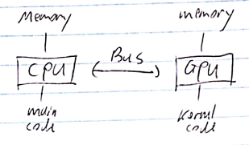
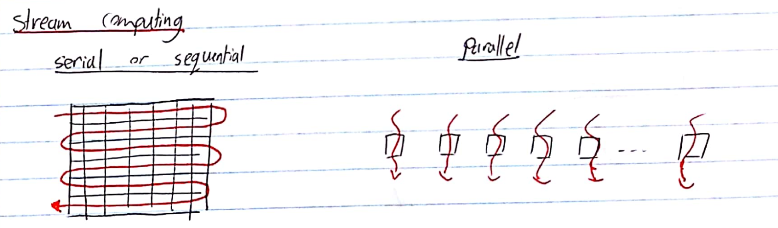
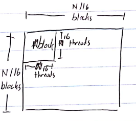

# Learn CUDA in an Afternoon

## Introduction

- Why is it faster? Many cores, a different kind of memory.
- But, GPUs cannot be used on their own. They're not good for an OS, for example.
- GPUs accelerate computationally demanding sections of code (which we call **kernels**). Kernels are decomposed to run in parallel on multiple cores.
- Separate memory spaces




- CUDA is an extension to C/C++ that allows programming GPUs.




- **SM** - streaming multiprocessor. The number of SMs and cores per SM varries across generations.
- $\Rightarrow$ we need an abstraction that will perform well across different generations of GPUs.
- This is abstracted as a **grid** of **thread blocks**.
- Each block in a grid contains multiple **threads**, mapping onto the **cores** in an SM.
- So, the mapping is
  - block $\rightarrow$ SM
  - thread $\rightarrow$ core in an SM
- Key thing is that we don't need to know the details of the hardware.
- Instead, we oversubscribe, and the system will perform the scheduling automatically. Use more blocks than SMs, and more threads than cores. This way everything is kept as busy as possible, giving the best performance.


## CUDA

- dim3 type

  ```c++
  dim3 my_xyz_values(xvalue, yvalue, zvalue);
  ```

- Access with .x, .y, etc (as usual).

### Hotel Example

- Serial solution:

```c++
for (i=0; i<N; i++) 
{
    result[i] = 2*i;
}
```

- Parallel solution:

```c++
__global__                   // specify that this is a kernel
void myKernel(int * result)
{
    int i = threadIdx.x;     // internal var unique to each thread in a block. 
                             //It's a dim3 type, but since our problem is 1D we only use .x
    result[i] = 2*i;
}
```

- Launching the kernel from the CPU:

```c++
dim3 blocksPerGrid(1, 1, 1);   // 1 block
dim3 threadsPerBlock(N, 1, 1); // N threads

myKernel <<<<blocksPerGrid, threadsPerBlock>>>>(result);
```

- The above example won't be fast since it only uses 1 block (which maps to **1** SM). To use multiple blocks:

```c++
__global__ void myKernel(int * result)
{
    int i = blockIdx.x * blockDim.x + threadIdx.x;
    result[i] = 2*x;
}
...
dim3 bpg(N/256, 1, 1); // assuming N % 256 == 0
dim3 tpb(256, 1, 1);
myKernel <<<<bpg, tpb>>>>(result);
```

- We have chosen to use 256 threads per block, which is typically a good number.

### Vector Addition Example

```c++
__global__ void vectorsAdd(float * a, float * b, float * c)
{
    int i = blockIdx.x * blockDim.x + threadIdx.x;
    c[i] = a[i] + b[i];
}
...
dim3 bpg(N/256, 1, 1);
dim3 tpb(256, 1, 1);
vectorsAdd <<<<bpg, tpb>>>>(a, b, c);
```

### 2D Example

```c++
__global__ void matrixAdd(float a[N][N], float b[N][N], float C[N][N])
{
    int j = blockIdx.x * blockDim.x + threadIdx.x;
    int i = blockIdx.y * blockDim.y + threadIdx.y;
    c[i][j] = a[i][j] + b[i][j];
}

int main()
{
    dim3 bpg(N/16, N/16, 1);
    dim tpb(16, 16, 1);
    matrixAdd <<<<bpg, tpb>>>>(a, b, c);
}
```



##Memory Management

- Stuff in the kernel has to point at GPU memory.
- alloc and freee memory on the GPU with:

```c++
float * a;
cudaMalloc(&a, N*sizeof(float));
...
cudaFree(a);
```

- Copying memory

```c++
cudaMemcpy(array_device, array_host, N*sizeof(float), cudaMemcpyHostToDevice);
cudaMemcpy(array_device, array_host, N*sizeof(float), cudaMemcpyDeviceToHost);
```

- (device - GPU, host - CPU).
- Transfers are relatively slow!

## Sync Between Host and Device

- Kernel calls are non-blocking (i.e., host program continue after it calls the kernel).
- Use *cudaThreadSynchronize()* to wait for the kernel to finish.
- Standard *cudaMemcpy* calls are blocking (non-blocking variants exist).
- It's good practice to just put a *cudaThreadSynchronize()* calls after your kernel call.

## Sync Between CUDA Threads

