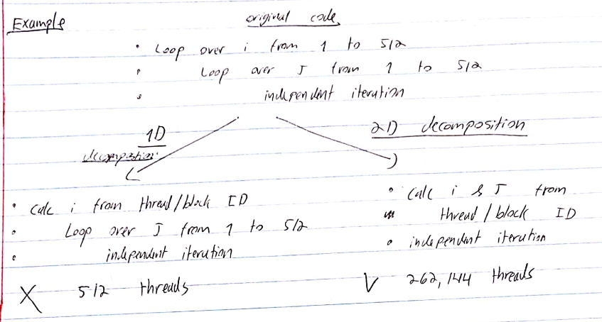
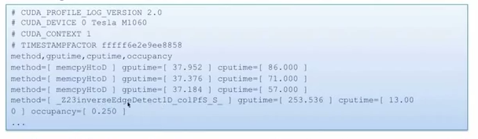

# Learn CUDA in an Afternoon

## Introduction

- These notes are based on [this](https://www.youtube.com/watch?v=_41LCMFpsFs&t=3386s) very good tutorial.
- Why is a GPU (sometimes) faster? It has many cores, and a different kind of memory.
- But, GPUs cannot be used on their own. They're not good for an OS, for example.
- GPUs accelerate computationally demanding sections of code (which we call **kernels**). Kernels are decomposed to run in parallel on multiple cores.
- Separate memory spaces


- CUDA is an extension to C/C++ that allows programming GPUs.


- **SM** - streaming multiprocessor. The number of SMs and cores per SM varries across generations.
- $\Rightarrow$ we need an abstraction that will perform well across different generations of GPUs.
- This is abstracted as a **grid** of **thread blocks**.
- Each block in a grid contains multiple **threads**, mapping onto the **cores** in an SM.
- So, the mapping is
  - block $\rightarrow$ SM
  - thread $\rightarrow$ core in an SM
- Key thing is that we don't need to know the details of the hardware.
- Instead, we oversubscribe, and the system will perform the scheduling automatically. Use more blocks than SMs, and more threads than cores. This way everything is kept as busy as possible, giving the best performance.


## CUDA Basics

- dim3 type

  ```c++
  dim3 my_xyz_values(xvalue, yvalue, zvalue);
  ```

- Access with .x, .y, etc (as usual).

### Hotel Example

- Serial solution:

```c++
for (i=0; i<N; i++) 
{
    result[i] = 2*i;
}
```

- Parallel solution:

```c++
__global__                   // specify that this is a kernel
void myKernel(int * result)
{
    int i = threadIdx.x;     // internal var unique to each thread in a block. 
                             //It's a dim3 type, but since our problem is 1D we only use .x
    result[i] = 2*i;
}
```

- Launching the kernel from the CPU:

```c++
dim3 blocksPerGrid(1, 1, 1);   // 1 block
dim3 threadsPerBlock(N, 1, 1); // N threads

myKernel <<<<blocksPerGrid, threadsPerBlock>>>>(result);
```

- The above example won't be fast since it only uses 1 block (which maps to **1** SM). To use multiple blocks:

```c++
__global__ void myKernel(int * result)
{
    int i = blockIdx.x * blockDim.x + threadIdx.x;
    result[i] = 2*x;
}
...
dim3 bpg(N/256, 1, 1); // assuming N % 256 == 0
dim3 tpb(256, 1, 1);
myKernel <<<<bpg, tpb>>>>(result);
```

- We have chosen to use 256 threads per block, which is typically a good number.

### Vector Addition Example

```c++
__global__ void vectorsAdd(float * a, float * b, float * c)
{
    int i = blockIdx.x * blockDim.x + threadIdx.x;
    c[i] = a[i] + b[i];
}
...
dim3 bpg(N/256, 1, 1);
dim3 tpb(256, 1, 1);
vectorsAdd <<<<bpg, tpb>>>>(a, b, c);
```

### 2D Example

```c++
__global__ void matrixAdd(float a[N][N], float b[N][N], float C[N][N])
{
    int j = blockIdx.x * blockDim.x + threadIdx.x;
    int i = blockIdx.y * blockDim.y + threadIdx.y;
    c[i][j] = a[i][j] + b[i][j];
}

int main()
{
    dim3 bpg(N/16, N/16, 1);
    dim tpb(16, 16, 1);
    matrixAdd <<<<bpg, tpb>>>>(a, b, c);
}
```


##Memory Management

- Stuff in the kernel has to point at GPU memory.
- alloc and freee memory on the GPU with:

```c++
float * a;
cudaMalloc(&a, N*sizeof(float));
...
cudaFree(a);
```

- Copying memory

```c++
cudaMemcpy(array_device, array_host, N*sizeof(float), cudaMemcpyHostToDevice);
cudaMemcpy(array_device, array_host, N*sizeof(float), cudaMemcpyDeviceToHost);
```

- (device - GPU, host - CPU).
- Transfers are relatively slow!

## Sync Between Host and Device

- Kernel calls are non-blocking (i.e., host program continue after it calls the kernel).
- Use *cudaThreadSynchronize()* to wait for the kernel to finish.
- Standard *cudaMemcpy* calls are blocking (non-blocking variants exist).
- It's good practice to just put a *cudaThreadSynchronize()* calls after your kernel call.

## Sync Between CUDA Threads

- To sync between threads in a block, use *syncthreads()*.
- Example: To communicate a value between threads (assume x is local and the array is shared):

```c++
if (threadIdx.x == 0) array[0] = x;
syncThreads();
if (threadIdx.x == 1) x = array[0];
```

- It is not possible to communicate vetween different blocks. You must instead exit the kernel and start a new one.

## GPU Performance Inhibitors

- Copying data to/from device.
- Device under-utilization / GPU memory latency.
- GPU memory bandwidth.
- Code branching.

### Host - Device Data Copy

- Copying data from host to device is expensive. We want to minimize these copies.
- Keep data resident on device. May require importing routines to device, even if they are not computationally expensive.
- Might be quicker to calculate something from scratch on the device instead of copying.

#### Data Copy Optimization Example

```
loop over timesteps
	inexpensive_routine_on_host(data_on_host)
	copy data from host to device
	expensive_routine_on_device(data_on_device)
	copy data from device to host
end
```

- The above will be slow!
- Port inexpensive routine to device and move data copies outside of loop:

```
copy data from host to device
loop over timesteps
	inexpensive_routine_on_device(data_on_device)
	expensive_routine_on_device(data_on_device)
end
copy data from device to host
```

### Exposing Parallelism

- GPU performance relies on the usage of many threads.
- If a lot of code remains serial, effectiveness of GPU will be limited (Amdahl's Law).

### Occupancy and Memory Latency Hiding

- Decompose loops to threads.
- For best performance, # threads >> # cores
- Accesses to GPU memory have take several hundred cycles latency. When a thread stalls waiting for data, if another thread can switch in this latency can be hidden.
- NVIDIA GPUs have very fast thread switching.



### Memory Coalescing

- GPUs have high peak memory bandwidth. But this is achieved only when data is accesses for multiple threads in a single transaction. This is called **memory coalescing**.
- To achieve this, **ensure that consecutive threads access consecutive memory locations!**
- Example (good):

```c++
index = blockIdx.x * blockDim.x + threadIdx.x;
output[index] = 2*input[index];
```

- Example (bad): in c, outermost index runs fastest (which is j here)

```c++
i = blockIdx.x * blockDim.x + threadIdx.x;
for (j=0; j<N; j++)
	output[i][j] = 2*input[i][j];
```

this is not coalesced! Consecutive threadIdx.x corresponds to consecutive i values...

- Example (good):

```c++
j = blockIdx.x * blockDim.x + threadIdx.x;
for (i=0; i<N; i++)
	output[i][j] = 2*input[i][j];
```

- What about using 2D or 3D decompositions?
  - Same procedure. X component of threadIdx is always that which increments consecutive threads.
  - e.g., for matrix addition, coalescing is achieved as follows:

```c++
int j = blockIdx.x * blockDim.x + threadIdx.x;
int i = blockIdx.y * blockDim.y + threadIdx.y;
c[i][j] = a[i][j] + b[i][j];
```

### Code Branching

- In a regular CPU the cores are all independent of each other and have their own scheduler. But in a GPU, there are less instruction scheduling units than there are cores.
- This means that threads have to be scheduled in groups. They are scheduled in groups of 32, called a *warp*.
- Threads within a warp must execute the same instruction in lock-step (on different data elements).
- The CUDA programming allows branching, but this results in all cores following all branches
  - With only the required results saved
  - This is obviously suboptimal (?)
- Must avoid intra-warp branching whenever possible (especially in key computational sections).
- Example:

```c++
i = blockIdx.x * blockDim.x + threadIdx.x;
if (i%2 == 0)
	...
else
	...	
```

here threads within warp diverge, which is not good.

```c++
i = blockIdx.x * blockDim.x + threadIdx.x;
if ((i/32)%2 == 0)
	...
else
	...
```

and here threads within warp follow the same path, which is good.

### CUDA Profiling

- Simply set COMPUTE_PROFILE environment variable to 1
- Log file, e.g., cuda_profile_0.log created at runtime: timing information for kernels data transfer



- Possible to output more metrics (cache misses etc).

## TODO

[Exercises](https://agray3.github.io/files/learnCUDApractical.pdf)